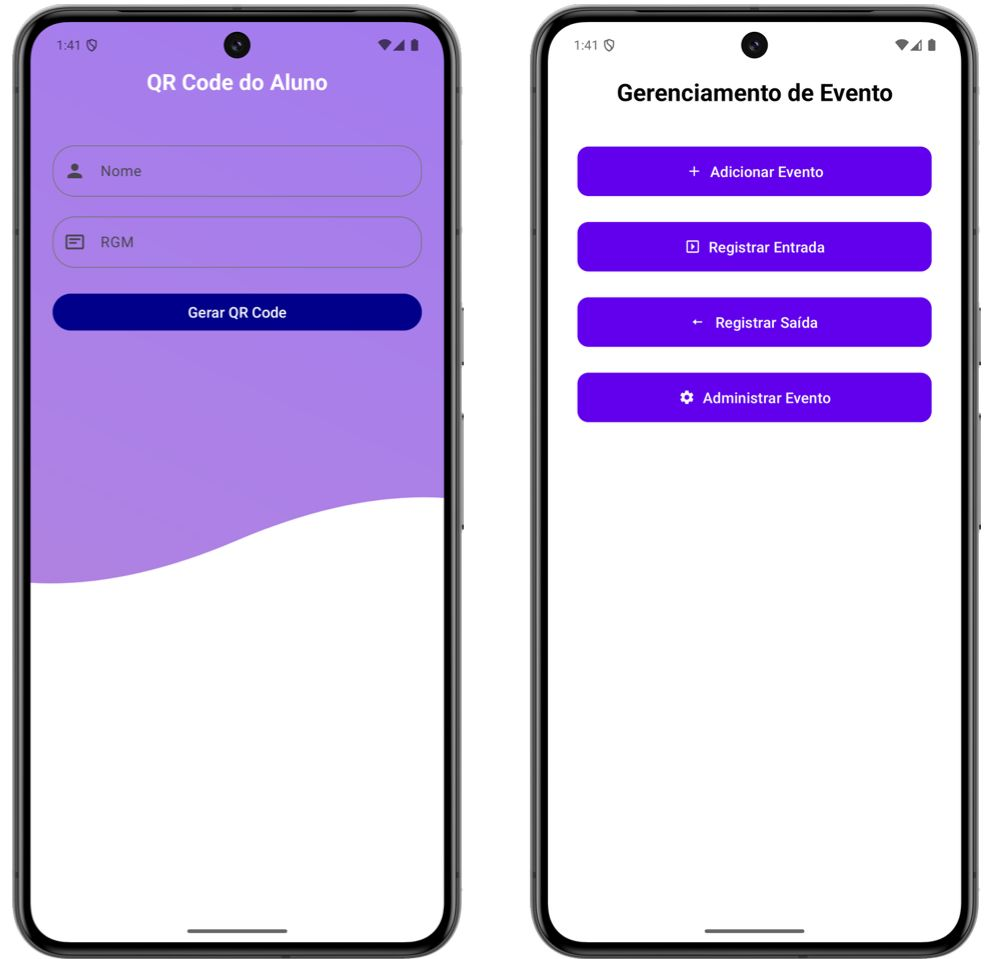
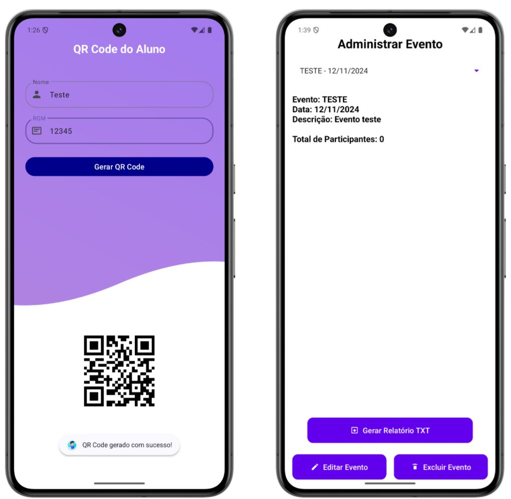

# Gerenciador de Eventos Mobile – Projeto Acadêmico

> Trabalho de **Desenvolvimento Mobile** que recebeu a melhor avaliação das turmas, graças ao **comportamento exclusivo de "Evento Simples" e "Evento Composto"**, permitindo desde check‑in único até múltiplos pontos de controle num mesmo evento.

---

## Visão Geral

Este repositório contém **duas** aplicações Android escritas em **Java (versão 1.8)**:

| App                  | Função                                                                                                                                                              |
| -------------------- | ------------------------------------------------------------------------------------------------------------------------------------------------------------------- |
| **EventoAdminApp**   | Lado do organizador: cria e edita eventos (simples ou compostos), cadastra participantes, gera e lê QR Code, acompanha presença em tempo real e exporta relatórios. |
| **EventoUsuarioApp** | Lado do participante: gera seu QR Code pessoal e realiza check‑in/check‑out nos pontos definidos pelo organizador.                                                  |

Ambos os apps usam **Android Jetpack**, banco local **SQLite** (via `SQLiteOpenHelper`), e a biblioteca **ZXing** para QR Code.

---

## Características-chave

* **Evento Simples:** único ponto de check‑in; presença confirmada apenas uma vez.
* **Evento Composto:** múltiplos pontos (palestras, oficinas); opção de contagem única ou múltipla pela ordem de chegada.
* **Offline-first:** todas as informações são salvas localmente e sincronizadas quando há conexão.
* **Relatórios:** exportação de participantes presentes em CSV/TXT diretamente do dispositivo.

---

## Estrutura de Pastas

```
.
├── EventoAdminApp/
│   └── app/src/main/java/com/example/eventoadminapp/
│       ├── adapters/      # Adapters para RecyclerView
│       ├── dao/           # Classes de acesso a dados (SQLite)
│       ├── layouts/       # Activities e componentes de UI
│       └── model/         # Modelos: Evento, Participante, Ponto
└── EventoUsuarioApp/
    └── app/src/main/java/com/example/eventousuarioapp/
        ├── layouts/       # Activities e componentes de UI
        └── util/          # QRCodeGenerator
```

---

## 📸 Showcase

<table>
  <tr>
    <th align="center">App Organizadora</th>
    <th align="center">App Participante</th>
  </tr>
  <tr>
    <td align="center">
      
    </td>
    <td align="center">
      
    </td>
  </tr>
</table>

---

## ⚙️ Como Executar

```bash
# Clone o repositório
git clone https://github.com/LCGant/qr-event-manager.git
cd qr-event-manager

# Importe os módulos no Android Studio:
# - EventoAdminApp
# - EventoUsuarioApp

# Sincronize o Gradle e rode os apps em emulador ou dispositivo.
```

---

## 📄 Licença

Disponibilizado sob **MIT License**.

---

> **Nota:** Este repositório serve apenas como *arquivo histórico* do projeto; *pull requests não serão analisados*.
